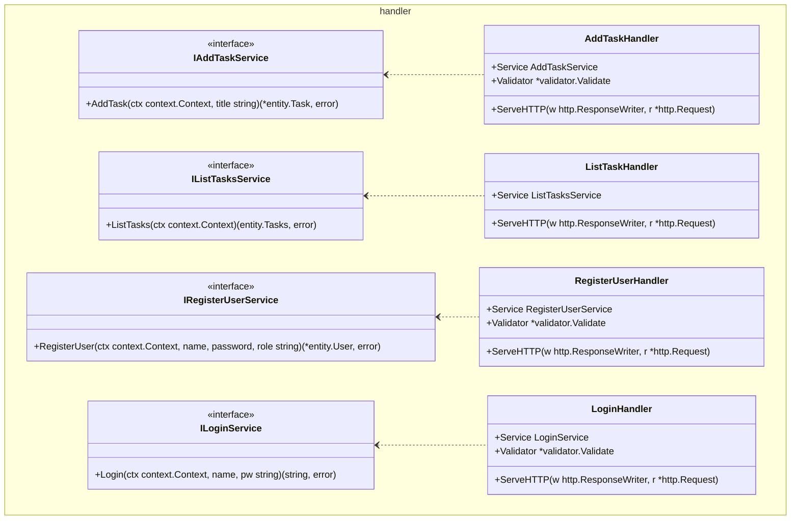
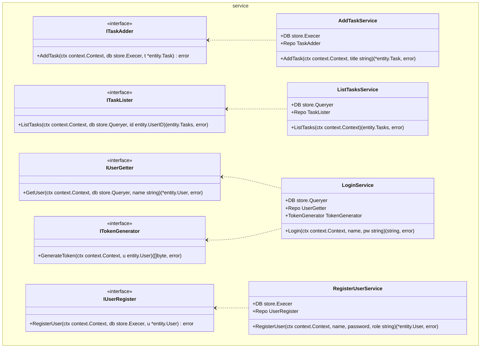
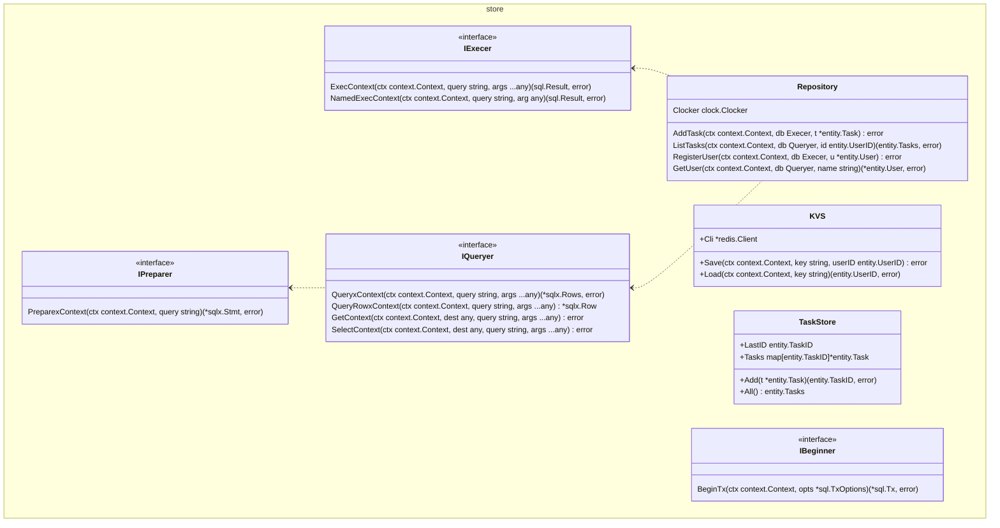
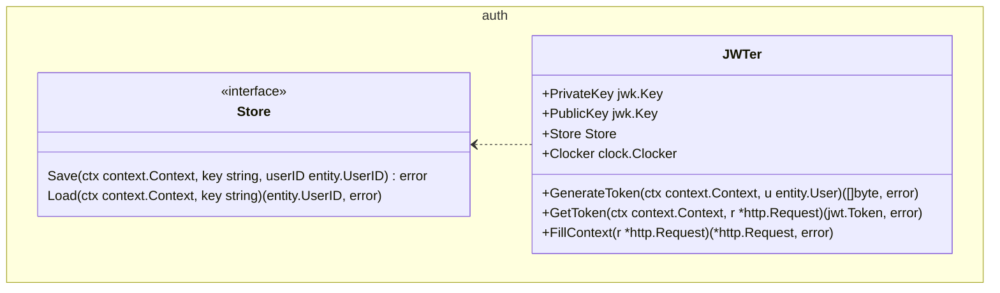
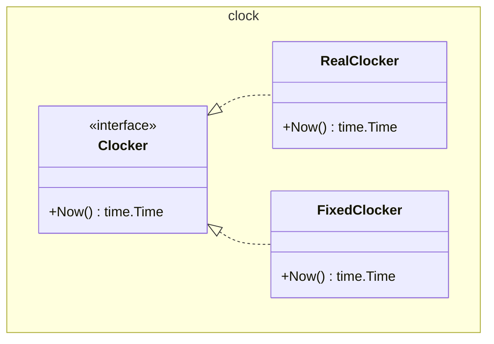

# パッケージ構成図

- パッケージ内の構成要素の関係を図示したもの。  
- パッケージ間の関係は図示していない。
- 実装上のインターフェース名は構造体名と被っているので、図では名前が被らないようにインターフェース名の先頭にIを付けている。

## handler package

## service package

## store package

## auth package

## clock package

